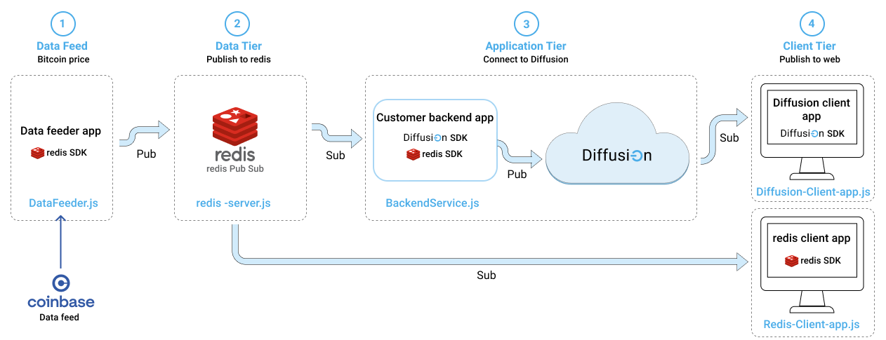

# Extend Redis with Diffusion

Introduction to Diffusion Real-Time Event Stream through a simple application using [Diffusion Cloud](https://www.pushtechnology.com/product-overview) and Redis Pub/Sub Server.

This JavaScript code example will help you publish data on real-time from a public API to Redis, consume from it and transform data on-the-fly via our powerful [Topic Views](https://docs.pushtechnology.com/docs/6.5.2/manual/html/designguide/data/topictree/topic_views.html) feature. You can also use other programming languages from our [SDKs](https://docs.pushtechnology.com/#sdks), including iOS, Android, C, .NET, and more. 

# What this tutorial does

## Data Pipeline


## Diffusion Cloud Credentials

We first setup our Diffusion Cloud Credentials, you can use the ones we provide in this tutorial, or you can create your own in [Diffusion Cloud](https://management.ad.diffusion.cloud/)
## 1) Data Feed
For the purposes of this tutorial, we are going to be using the [Coindesk API](https://api.coindesk.com/v1/bpi/currentprice.json) to retrieve Bitcoin current value, in USD, Euros and GBP.
```
 https://api.coindesk.com/v1/bpi/currentprice.json
```


We created a [component](./redis-app/js/data-feed/DataFeed.js) that connects to the Coinbase REST API and, as it receives updates, it publishes values into the Redis Service in the Data tier.

Once the Coinbase data is in Redis, we can visualize it in the app.

## 2) Data Tier: Redis Pub/Sub


We have in place a [Nodejs](./redis-app/js/data-tier/redis-server.js) application. This app serves as a passthrough between the data feed and the redis server, and back.

## 3) Application Tier  

### [Backend App](./redis-app/js/application-tier/BackendApp.js)

This App is consuming data from the Redis Topic, and in turn, publishes the same content to a [Diffusion Cloud service](https://dashboard.diffusion.cloud/signup), using [Diffusion SDK](https://docs.pushtechnology.com/#sdks). Here is where all Business logic could programatically be implemented. This is usually how it goes, if we didn't have Diffusion capabilities to do make things easier for us.

### [Diffusion Cloud service](https://dashboard.diffusion.cloud/signup)
This is where the magic happens, data received can be Enriched and Fine Grained thanks to [Topic Views](https://docs.pushtechnology.com/docs/6.5.2/manual/html/designguide/data/topictree/topic_views.html), allowing Clients to consume only relevant data and increasing data efficiency.


Once data is flowing into [Diffusion Cloud](https://www.pushtechnology.com/product-overview), any client application can subscribe to it very easily.

## 4) Client Tier: 
 

In the client Tier, we have both [Redis](./redis-app/js/client-tier/RedisClient.js) and [Diffusion](./redis-app/js/client-tier/DiffusionClient.js) Clients. These clients are subscribed to either Redis and Diffusion topics, and showing received values in their charts.  
Check **Data Received** in the Diffusion Client. You'll notice as the data is consumed, it take much less data than Redis Client, thanks to Diffusion Cloud data crunching capabilities.
# The code in Actionv

## How it works

### Redis and Web Servers 
We use [docker](./redis-app/docker-compose.yaml) to setup and run a Redis Server and a Web Server to host the web application.  

### (1) Data feed
We are polling our data from an External API, in this case, [Coindesk](https://api.coindesk.com/v1/bpi/currentprice.json). And Publishing it to Redis.

```javascript
/**
* The function that handles the call to the API when polling
*/
callEndpoint = async () => {
    const response = await fetch(this.apiUrl);
    const contentLength = response.headers.get("content-length");
    const data = await response.json();
    // Show the data from the API in the response element
    const formatter = new JSONFormatter(data);
    this.responseBodyEl.innerHTML = '';
    this.responseBodyEl.appendChild(formatter.render());
    
    // Publish polled data to Redis Websocket
    this.redisWebSocket.send(JSON.stringify(data));
}
```

### (2) Redis NodeJS Server (Data Tier)
To interface with the Redis Server, we built a NodeJS [Server](./redis-app/js/redis-server/redis-server.js). This App runs **server side** next to the Redis Server.

   1. The NodeJS Server will connect to the Redis Server and create and use a Topic, to stream data through. To perform this interaction, both **redisPublisher** and a **redisConsumer** clients are instantiated
   2. To communicate with the Web App (a client), it will open a connection to a WebSocket. We use port 3000.
   3. Every data that is consumed from the WebSocket is published to the Redis Server's Topic by the redisPublisher
   4. Every data consumed from Redis Server with the redisConsumer object is, in turn, published to the WebSocket.

This is the piece of code that represents that interaction:

```javascript
server.on('connection', function connection(ws) {
    // Message Received in Socket from webclient, and sent to redis
    ws.on('message', function (event) {
        console.log('Message from Websocket:', event);
        redisPublisher.publish(REDIS_CHANNEL, event);
    });

    // Message received from Redis, and sent through Websocket to Webclients
    redisSubscriber.on('message', function (channel, message) {
        console.log('Redis Subscriber: ', channel, message);
        ws.send(message);
    })
});
```
### (3) Backend App (Application Tier)
We are consuming from Redis and publishing to Diffusion:
```javascript
/**
     * Add the websocket listener to listen for Redis Messages
     */
    startListeningRedisWebSocket = () => {
        console.log('--- BackendApp: Connecting to WebSocket ---');
        /* Then, we setup Redis Topic listener on the websocket */
        this.redisWebSocket.onmessage = ({ data }) => {            
            this.message = JSON.parse(data); // Parse the data from Redis
            console.log('Data received from Redis: ', this.message);
            
            // Publish received data to Diffusion
            this.publishToDiffusion(this.message);
        }
    }

    /**
     * Publish data received from socket to Diffusion
     * @param {*} data 
     */
    publishToDiffusion = data => {                
        if (this.diffusionService && this.diffusionService.diffusionClient) {
            this.diffusionService.publish(data);
        }
    }
```
We don't have any Diffusion Cloud Code here. This is simply because we have everything we need there, to implement our Business logic on the data, without the need to write code.

### (4) Diffusion Client (Client Tier)
We are going to describe only the Diffusion Client here, since the Redis one works pretty similar, but consuming from Redis.

So, the Diffusion Client consumes only the data it needs coming in the diffusion Topic, and shows it in the Chart:

```javascript
/**
 * Subscribe to a diffusion Topic.
 * If it's not yet connected, first connect
 */
subscribeToDiffusion = () => {
    if (!this.diffusionService.diffusionClient) {
        console.log('*** Diffusion Client: Connecting to Diffusion ***');
        this.diffusionService.connect(
            this.hostEl.value,
            this.userEl.value,
            this.passwordEl.value,
            this.topic,
            message => this.onDiffusionMessage(message)
        );
    }
}

/**
 * This is the callback the Diffusion Client calls when a message is received
 * We update the Client Tier chart with this info
 * @param {*} message 
 */
onDiffusionMessage = message => {
    console.log('on Diffusion message', message);

    this.updateDataReceived(JSON.stringify(message).length);

    // This message came from Diffusion! Feed Diffusion's Chart
    this.updateChart(message);
}
```

### [Diffusion Service](./redis.app/../redis-app/js/application-tier/lib/DiffusionService.js)
This service is used by both the **Application** and **Client** Tiers as an absctraction layer with Diffusion Cloud, through its **Javascript SDK Client**.

This is the connect function:

```javascript
/**
     * This is the event handler when the Connect to Diffusion button is clicked
     * @param {*} evt 
     */
    connect = (
        host, user, password, topic, onMessageCallback
    ) => {
        console.log('Connecting to Diffusion');        

        // Instantiate Diffusion's Client
        // We send the connect and on message callbacks to handle those events
        this.diffusionClient = new Diffusion(this.onConnectedToDiffusion, onMessageCallback || this.onDiffusionMessage);

        // Set Diffusion config
        this.diffusionClient.setConfig({
            host: host,
            user: user,
            password: password,
            topic: topic
        });

        // And connect to it
        this.diffusionClient.connect();
    }

    /**
     * This is the callback, Diffusion client calls after connection
     */
    onConnectedToDiffusion = () => {
        console.log('connected to diffusion');
        // Once we're connected, subscribe to the topic we specified when connecting to Diffusion service
        // We're not sending any parameters because we already set those when calling the setConfig function in the previous method.
        this.diffusionClient.subscribe({}); //Subscribe to Diffusion's topic
    }
```

And this is how the Service uses the SDK to publish messages:
```javascript
/**
 * Publish to diffusion
 * @param {*} data 
 */
publish = data => {
    this.diffusionClient.publishData(data);
}
```

### [Diffusion SDK Client](./redis-app/js/application-tier/lib/Diffusion.js)
Finally we have the piece of code in charge of directly interfacing with the **Diffusion Javascript SDK**. This is the class that's used by the **Diffusion Service** in both **Application** and **Client** Tiers.

This is how it connects to Diffusion, using SDK functions:
```javascript
/**
 * This method is used to configure Diffusion connection
 * @param host The host of the Diffusion Service
 * @param user The user to the Diffusion Service
 * @param password
 * @param topic The topic name to be created and consumer from
 */
setConfig = ({ host, user, password, topic }) => {         
    this.host = host || '127.0.0.1';
    this.user = user || 'admin';
    this.password = password || 'password';
    this.topic = topic || 'default-topic';
    this.subscribedTopic = topic || 'default-topic';
}

/**
 * Method that handles connection to the Diffusion Service      
 */
connect = () => {
    /* Connect to Diffusion using the parameters previously set in setConfig method */
    diffusion.connect({
        host: this.host,            
        principal: this.user,
        credentials: this.password,                       
        port: 443,
        secure: true
    }).then((session) => {
        this.session = session;
        /* Here's where we add the topic we are going to be using */
        this.session.topics.add(this.topic, diffusion.topics.TopicType.JSON)            
        console.log(`Connected: `, this.session.sessionId);

        /* If we setup a connected callback, let's call it */
        if (this.onConnectedCallback) {
            this.onConnectedCallback();
        }            
    });
}
```

This is how it subscribes to Topics, and handles messages received in that Topic:
```javascript
/**
 * Method to subscribe to a topic and start consuming it
 * @param session We can pass an already existing session, otherwise it will use the internal one
 * @param topicPath Set a topic to subscribe to, if empty uses the internal one
 * @param onValueCallback callback to be called when a value is arrives in the topic. It can be null
 */
subscribe = ({ session = undefined, topicPath = '', onValueCallback = null }) => {
    const currentSession = session || this.session;
    const currentTopic = topicPath || this.topic;
    console.log(`subscribing to: ${currentTopic}`);
    
    /* We Setup the stream */
    currentSession.addStream(
        currentTopic,
        diffusion.datatypes.json()).on('value',
            onValueCallback || this.onReceiveMessage
        );

    /* And subscribe to the topic */
    currentSession.select(currentTopic);
}

onReceiveMessage = (topic, specification, newValue, oldValue) => {
    let message = newValue.get();
    message.receiveTime = new Date();
    console.log(`TOPIC - Receiving message for topic: ${topic}`, specification, newValue.get(), oldValue.get());
    if (this.onReceiveMessageCallback) {
        this.onReceiveMessageCallback(message, topic);
    }
}
```
And finally this is how it publishes messages to a Topic:
```javascript
// Interface Functions
publishData(data) {        
    if (this.session) {
        this.session.topicUpdate.set(this.topic, diffusion.datatypes.json(), data);
    }
}
```

# Pre-requisites

*  Download our code examples or clone them to your local environment:
```
 git clone https://github.com/diffusion-playground/redis-integration/
```
* A Diffusion service (Cloud or On-Premise), version 6.6 or greater. Create a service [here](https://dashboard.diffusion.cloud/signup).
* Follow our [Quick Start Guide](https://docs.pushtechnology.com/quickstart/#diffusion-cloud-quick-start) and get your service up in a minute!

# Running it
1. Requirements:
    1. docker and docker-compose
    2. nodejs and nodemon
2. From the root of the project, run: docker-compose up -d -> To start the Web Server and the Redis Server.
3. From the root of the project run:
    1. nodemon js/redis-server/redis-server.js -> To start the redis service
4. In your browser, go to: localhost:8008.
5. There you go! 
    1. First start listening to the API and running the Redis Server, on the left.
    2. Then connect to Diffusion on the right
    3. You'll see both charts being updated. Check the size of the data received by the charts and realize how much data you can save with Diffusion!
